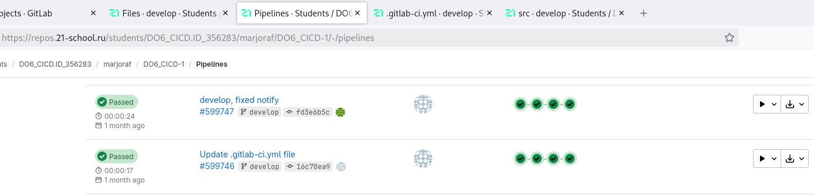

# Basic CI/CD

Разработка простого **CI/CD** для проекта на C. Сборка, тестирование, развертывание.

### Настройка **gitlab-runner**

##### Создание виртуальной машины *Ubuntu Server 22.04 LTS*.

##### Загрузка и установка **gitlab-runner**.

##### Запуск **gitlab-runner** и регистрация.

### Этап деплоя

**== Задание ==**

##### Создание второй виртуальной машины *Ubuntu Server 22.04 LTS*.

##### Успешное копирование файлов, полученных после сборки (артефактов), в директорию */usr/local/bin* второй виртуальной машины.

### Уведомления

**== Задание ==**

#### Настрой уведомления об успешном/неуспешном выполнении пайплайна через бота с именем «[твой nickname] DO6 CI/CD» в *Telegram*.
##### Скрытая конфигурация бота.

##### Получение сообщений от бота.

##### Скриншоты пайпланов финальной версии

