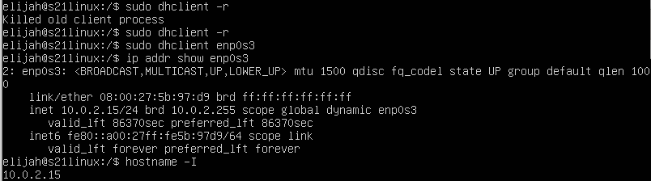
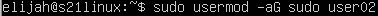
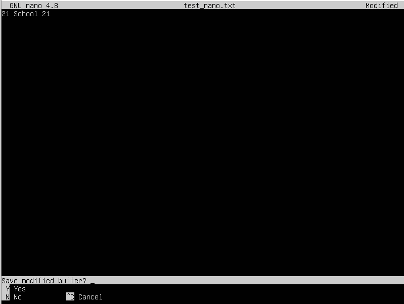
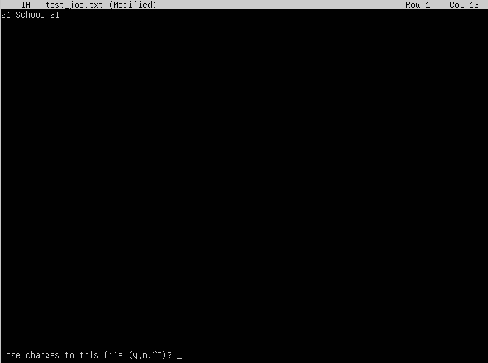
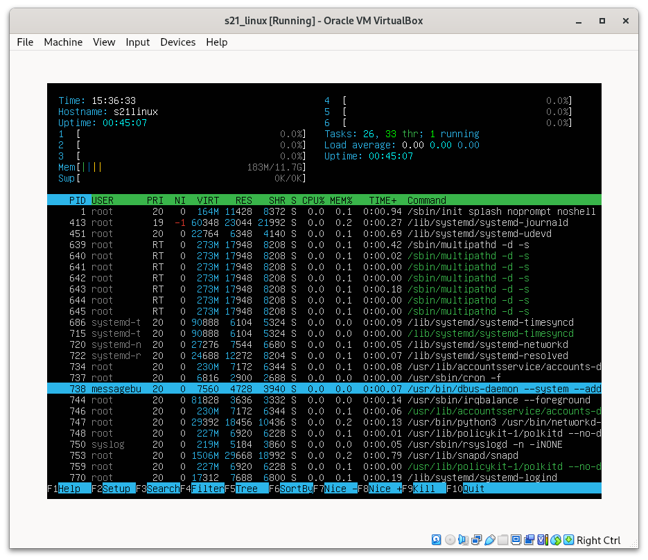

## Part 1. Установка ОС
Версия Ubuntu после установки

## Part 2. Создание пользователя
- Команда для создания пользователя в группе adm

- Вывод списка пользователей через cat /etc/passwd (новый пользователь указан в конце списка)

## Part 3. Настройка сети ОС
- Машине присвоено название user-1

- Установлен мой часовой пояс

- Вывод названий сетевых интерфейсов

- lo (loopback device) - стандартный виртуальный интерфейс Linux, используется для настройки сетевых программ на локальной машине без непосредственного доступа к сети.
Его локальный адрес всегда 127.0.0.1. DNS-имя - localhost.

- Получение адреса устройства от DHCP сервера

DHCP - Dynamic Host Configuration Protocol

- Получение внешнего IP-адреса

- Получение внутреннего IP-адреса

- Изменение настроек ip, gw, dns вручную

- Применение настроек и перезагрузка

- Проверка заданных настроек

- Пинг 1.1.1.1 и ya.ru

## Part 4. Обновление ОС
- Команды для обновления

- Проверка обновления

## Part 5. Использование команды sudo
sudo (superuser do) - позволяет выполнить команду, используя максимальные права в этом конкретном случае.

- Предоставление прав выполнять команду sudo

- Измнение hostname от имени нового пользователя

## Part 6. Установка и настройка службы времени
Вывод времени и проверка синхронизации

## Part 7. Установка и использование текстовых редакторов
- Установлен Vim. Для выхода с сохранением изменений я нажал esc, :w, затем укзал имя файла. Затем :q.

- Установлен Nano. Для выхода с сохранением измнений я нажал ^O, указал имя файла, затем нажал ^X.

- Установлен Joe. Для выхода с сохранением изменений я нажал ^KX, затем указал имя файла.

- Редактирование файла и выход без сохранений в следующих редакторах:
Vim - Esc, :q!

- Nano - ^X

- Joe - ^C

Поиск и замена в следующих редакторах:
- Vim - /искомое

- Vim - :s/искомое/замена

- Nano - ^W, затем ввод искомого

- Nano - ^/, ввод искомого, ввод замены

- Joe - ^KF, ввод искомого, I

- Joe - ^KF, ввод искомого, R, ввод замены, Y

## Part 8. Установка и базовая настройка сервиса SSHD
Установка службы SShd

Использовал команды sudo systemctl start sshd и sudo systemctl enable sshd для установки автозапуска службы

Настройка службы на порт 2022 и проверка наличия процесса sshd

ps - вывод информации о текущих процессах
-e - отобразить все процессы
|grep sshd - отобразить строки, содержащие "sshd"

Для перезагрузки используется команда reboot
Вывод команды netstat -tan

- Proto - протокол, используемый для соединения.

- Recv-Q - количество байтов на приём.  

- Send-Q - количество байтов на отправку. 

- Local Address - адрес и номер локального конца сокета.

- Foreign Address - адрес и номер порта удалённого конца сокета.

- State - состояние сокета. Listen - cокет ожидает входящих подключений.

- 0.0.0.0 - устройство прослушивает все доступные адреса.

- -t отображает только соденинения типа tcp.

- -a оторбажает сведения о состоянии всех сокетов (включая сокеты серверных процессов)

- -n отображает сетевые адреса как числа.

## Part 9. Установка и использование утилит top, htop
Вывод команды top

- uptime -  16 мин.

- количество авторизованных пользователей - 1

- общая загрузка системы - 0.00, 0.00, 0.00

- общее количество процессов - 136

- загрузка cpu - время простоя - 100.0%, системные процессы, процессы с изменным приоритетом, процессы ввода-вывода, аппаратные прерывания, программные прерывания, время ожидания виртуальных процессов - 0.0%

- загрузка памяти - общий объем - 11965.0 Мб, свободная память - 11403.9 Мб, используемая - 182.6 Мб, память для буферов и кэша - 378.4 Мб

- pid процесса занимающего больше всего памяти - 753

- pid процесса, занимающего больше всего процессорного времени - 753

Вывод команды htop со следующими типами сортировки:
- PID

- PERCENT_CPU

- PERCENT_MEM

- TIME

- Для процесса sshd

- Через поиск найден процесс syslog

- Добавлены hostname, clock, uptime

## Part 10. Использование утилиты fdisk
Вывод команды fdisk -l

Название диска - /dev/sda, размер - 15 Гб, swap отсутствует, количество секторов - 31457280.

## Part 11. Использование утилиты df
Вывод команды df для корневого раздела

Информация о корневом разделе:

- размер раздела - 10218772 Кб

- размер занятого пространства - 3146860 Кб 

- размер свободного пространства - 6531240 Кб

- процент использования - 33

Вывод команды df -Th для корневого раздела

Информация о корневом разделе:

- размер раздела - 9.8 Гб

- размер занятого пространства - 3.1 Гб

- размер свободного пространства - 6.3 Гб

- процент использования - 33

- тип файловой системы - ext4

## Part 12. Использование утилиты du
Информация о размере папок в байтах

Размер каждого элемента /var/log в байтах

## Part 13. Установка и использование утилиты ncdu
Команда ncdu даёт возможность просматривать объем папок следующим образом:
- /home

- /var

- /var/log

## Part 14. Работа с системными журналами
Системные журналы:
- dmesg

- syslog

- auth.log

- Перезапуск службы SSHd

- Сообщения об этом в syslog

## Part 15. Использование планировщика заданий CRON
- Создание задачи в cron

- Информация в системном журнале о выполнении задачи

- Список задч в cron до удаления

С помощью crontab -r удаляем этот файл
- Получается пустой список задач по умолчанию

